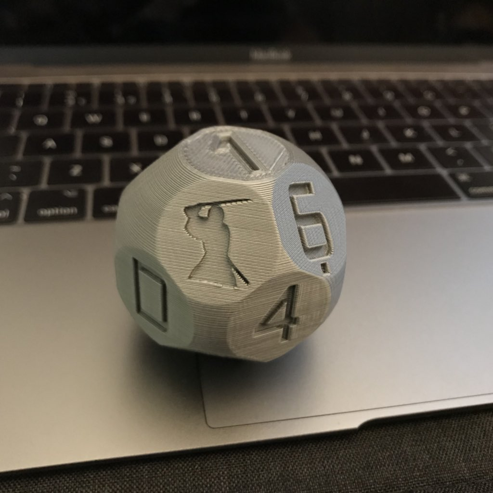

# Samourai Hexadecimal Dice

Samourai adaptation of hexadecimal dice ('A' value replaced by Samourai logo).

## Printing the dice

Download the [STL file](./sixteen-sided-hexidecimal-die.stl) to print. This is a standard STL file and should work out-of-the-box.


Printed die and pic: H/T [@diogorsergio](https://twitter.com/diogorsergio/status/997898691091582977)

## Ensuring fairness of the dice

Refer to the original [blog post](https://towardsdatascience.com/running-chi-square-tests-in-python-with-die-roll-data-b9903817c51b) for detatils.

In the table below three approaches to trow dices were recorded to be used then in the chi2-square independence test.

Side|Group 1|Group 2|Group 3
--- |  ---  |  ---  |  ---
0   |10	    |12	    |10
1   |4	    |2	    |2
2   |2	    |4	    |0
3   |9	    |5	    |4
4   |5	    |2	    |6
5   |8	    |9	    |8
6   |7	    |7	    |7
7   |3	    |4	    |5
8   |2	    |9	    |5
9   |8	    |7	    |5
A   |5	    |9	    |8
B   |6	    |2	    |6
C   |6	    |8	    |7
D   |4	    |3	    |1
E   |2	    |2	    |4
F   |4	    |5	    |4
Total|85    |90	    |82

This dataset is used in first part of the calculation in the form of numpy array:

```python
dice = np.array([ [10,4,2,9,5,8,7,3,2,8,5,6,6,4,2,4], [12,2,4,5,2,9,7,4,9,7,9,2,8,3,2,5], [10,2,0,4,6,8,7,5,5,5,8,6,7,1,4,4]])
```

Then numpy sums array lines and the script executes standard chi-square test assuming that expected distribution is equal to all 16 categories. 

For instance dataset it was failed and the dice is not fair. You can proceed to [Original notice](## Original notice:)

## Watch-only wallet

### From entropy to mnemonic

#### Creating BIP39 entropy

Determine which die represents the high-order bits either by printing the dice in different colors or by always taking the leftmost die thrown as the high-order bits of the byte.

For a 12-word mnemonic, throw the dice 16 times and note down the hexadecimal values produced. This will produce 128 bits of entropy. For 24 words, perform 32 throws for 256 bits of entropy.

#### Converting entropy to BIP39 mnemonic

Use [https://bip32jp.github.io/english/](https://bip32jp.github.io/english/) offline or run a local copy by first downloading from the [repo](https://github.com/bip32JP/bip32JP.github.io).

In the area labeled **Input Your own Entropy**, check the radio button labeled  **Base 16 (0-9,A-F) (For 16-sided dice)**

Type or paste the hexadecimal string in the input field labeled **Input Your own Entropy**.

Just below the area labeled **BIP39 passphrase**, check the radio button that indicates the number of words corresponding to the amount of entropy you have generated.

Click on the button **Generate new phrase**.

Your mnemonic will appear in the input field labeled **BIP39 passphrase**. Make sure that you see the expected number of words.

### From mnemonic to wallet seed

#### Deriving your public keys

Use [https://iancoleman.io/bip39/](https://iancoleman.io/bip39/) offline or run a local copy by first downloading from the [repo](https://samourai.kayako.com/api/v1/articles/46/attachments/601/download).

In the area labeled **BIP39 Mnemonic**, type or paste your space-separated  mnemonic words.

In the area labeled **BIP39 Passphrase (optional)**, type your BIP39 passphrase.

Select the **BIP44** tab and copy the text displayed for **Account Extended Public Key**. It should begin with the letters *xpub*. This is your legacy account *(pay to public key hash, p2pkh)*. Note the first address displayed under **Derived Addresses**.

Select the **BIP49** tab and copy the text displayed for **Account Extended Public Key**. It should begin with the letters *ypub*. This is a segwit account *(pay to witness public key hash wrapped in pay to script hash, p2sh-p2wpkh)*.  Note the first address displayed under **Derived Addresses**.

Select the **BIP84** tab and copy the text displayed for **Account Extended Public Key**. It should begin with the letters *zpub*. This is a segwit account *(pay to witness public key hash, p2wpkh)*.  Note the first address displayed under **Derived Addresses**.

#### Using Sentinel

Sentinel can be downloaded from [Google Play](https://play.google.com/store/apps/details?id=com.samourai.sentinel&hl=en).

When inserting your extended public keys into Sentinel, be sure to provide the **BIP44** extended public key (*xpub*) by tapping on the menu selection **bitcoin wallet via XPUB (BIP44)**, and provide the **BIP49** (*ypub*) and **BIP84** (*zpub*) extended public keys by tapping on the menu selection **bitcoin wallet via Segwit YPUB/ZPUB (BIP49/84)**.

Verify that the first *deposit address* displayed matches the *derived address* that you noted down when you copied the corresponding extended public key.

## Acknowledgements

Thanks to [Chris McCormick](https://github.com/chr15m) for helping with this fork.


## Original notice:

Hopefully useful for generating private keys and the like. Author gives no guarantee of any statistical properties of the randomness of this die. You probably want to use other sources of entropy in combination with this. What if the NSA have backdoored your 3d printer with an infill-biasing algorithm that causes your die to be weighted statistically in favour of certain values? Pwned.

Based on a modified script from [Thingiverse by bwarne](http://www.thingiverse.com/thing:58408/#files).
